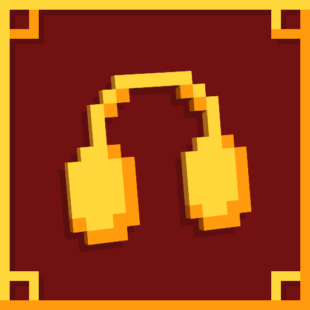

  

  <h1 align="center">Auditory Continued</h1>

  

    A Minecraft mod that reworks and enhances a lot of the sound aspects in Minecraft, from block sounds to item interaction sounds and more!
     
     
    
    
    
    
    
    
  

### Acknowledgments

* [Original Auditory mod](https://github.com/sydneybeanmc/auditory)
* [Stonecutter](https://stonecutter.kikugie.dev/)
* [Devins Badges](https://intergrav.github.io/devins-badges-docs)

(<a href="#readme-top">back to top</a>)

---

*For contributing, please refer to the [Contributing Guide](CONTRIBUTING.md).*